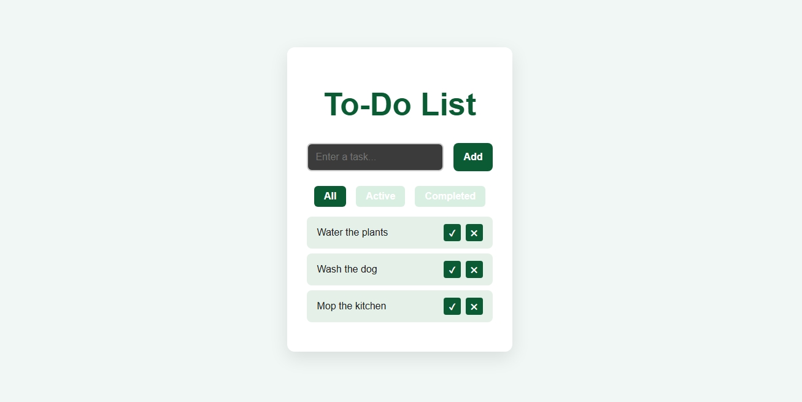
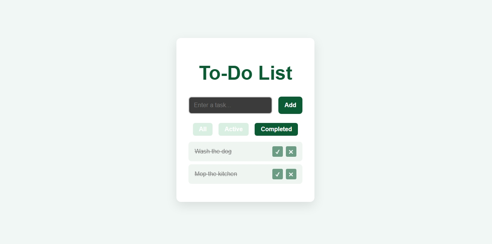

# React To-Do App

**Live Demo:** [Task by Task](https://taskbytask.netlify.app/)  

A responsive and interactive To-Do List application built with React. It allows users to add, complete, delete, and filter tasks — with local storage support so tasks persist after refreshing.

## Features

- Add new tasks
- Mark tasks as complete
- Delete tasks
- Filter tasks by All / Active / Completed
- Tasks saved in localStorage
- Fully responsive design

## Screenshot





## Built With

- React
- HTML / CSS
- JavaScript
- LocalStorage API

## Getting Started

### 1. Clone the repository
```bash
git clone https://github.com/DonovanWilliams0517/todo-app.git
cd todo-app
npm install
```

Folder Structure (Vite)

todo-app/
├── public/
├── src/
│   ├── App.jsx
│   ├── App.css
│   └── main.jsx
├── index.html
└── README.md
